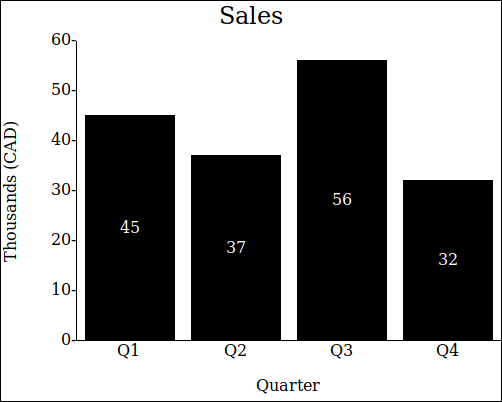

# Bar Chart

## About
This is an API to render a bar chart into your webpage. It can draw a chart with either single or stacked bars,
and includes many customizable style options. To use, include the drawBarChart.js file in your webpage, and call the 
`drawBarChart(data, options, element)` function.

## Examples

### Single bars:
```
const data = [45, 37, 56, 32]

const options = {
  height: '400px',
  width: '500px',
  backgroundColour: 'white',
  title: 'Sales',
  xAxisTitle: 'Quarter',
  yAxisTitle: 'Thousands(CAD)',
} 
```



### Stacked chart with all options:

```
const data = [
  { data: [7, 10, 6], label: "Q1", colours: ['black', 'white'], labelColours: ['white', 'black'] },
  { data: [6, 14, 3], label: "Q2", colours: ['black', 'white'], labelColours: ['white', 'black'] },
  { data: [10, 12, 4], label: "Q3", colours: ['black', 'white'], labelColours: ['white', 'black'] },
  { data: [3, 6, 3], label: "Q4", colours: ['black', 'white'], labelColours: ['white', 'black'] }
];
const options = {
  height: '500px',
  width: '600px',
  backgroundColour: 'wheat',
  title: 'Sales: p1 (black) vs p2 (white) vs p3(red)',
  titleFontColour: 'Red',
  xAxisTitle: 'Quarter',
  yAxisTitle: 'Thousands (CAD)',
  titleFontSize: '1.5em',
  barSpacing: 0.4,
  axisTitleFontSize: '1.2em',
  yAxisTicks: [0, 2, 4, 6, 8, 10, 12, 14, 16, 18, 20, 22, 24, 26, 28, 30],
  barBorders: 'on',
  dataPosition: 'top',
  barColour: 'red',
  labelColour: 'black',
  fontSize: '1em'
};
```


## Functions

`drawBarChart(data, options, element)`: The function to call to make the bar chart. It takes three arguments, `data`, 
`options`, `element`.
* `data`: An array, can contain either numbers, arrays of numbers, objects, or a mix of these three. Single number entries
will be a single bar of that height. An array of numbers will be a stacked bar containing those heights, in top down 
order. An object can have the properties:
  * `data`: A number, or array of numbers. A single number will be a single bar, an array of numbers will make a stacked bar.
  * `label`: A string, The label to appear on the x axis underneath the bar.
  * `colours`: An array of strings, the colours of the bars. Enter as a single entry array for a single bar.
  * `labelColours`: An array of strings, the colours of the bar labels. Enter as a single entry array for a single bar. 
* `options`: An object, it customizes your chart. Enter any colours as CSS accepted [colours](https://developer.mozilla.org/en-US/docs/Web/CSS/color_value), and any lengths as
CSS accepted [lengths](https://developer.mozilla.org/en-US/docs/Web/CSS/length) or [percentages](https://developer.mozilla.org/en-US/docs/Web/CSS/percentage). The properties it can have are:
  * `height`: A string, the total height for your bar chart. 
  * `width`: A string, the total width of your bar chart.
  * `backgroundColour`: A string, the background colour for the bar chart. 
  * `yAxisTicks`: An array of numbers, the tick marks to display on the y-axis of the chart. 
  * `fontSize`: A string, the size of font for the y-axis labels, x-axis labels, and bar labels.
  * `title`: A string, the main title for your chart. 
  * `titleFontSize`: A string, the size for your main title's font. 
  * `titleFontColour`: A string, the font colour for your main title's font. 
  * `xAxisTitle`: A string, the title for the x-axis.
  * `yAxisTitle`: A string, the title for the y-axis.
  * `axisTitleFontSize`: A string, the size for the axes font. 
  * `barBorders`: A string, if set to "on", will set borders around all bar sections. 
  * `barSpacing`: A number between 0 and 1, the proportion of the charts length to be spacing.  
  * `barColour`: A string, the default colour for any bars with unspecified colour.
  * `labelColour`: A string, the default colour for any bar labels with unspecified colour. 
  * `dataPosition`: A string, the position for the data labels inside the bars. Can be set to either "top", "center", or "bottom".
* `element`: A jQuery or DOM element, the element for the chart to render into.

## Features

For a list of currently implemented features, see the properties of the `options` argument. Planned features for 
the future are:

* An optional legend for stacked bars.

## Resources:

The reference sources used in building this API were:

* [stackoverflow.com](https://stackoverflow.com) 
* [developer.mozilla.org](https://developer.mozilla.org)
* [www.w3schools.com/](https://www.w3schools.com/)
* [api.jquery.com/](https://api.jquery.com/)


